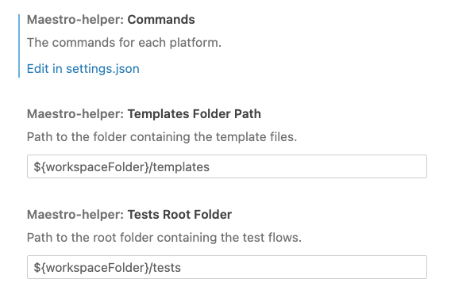
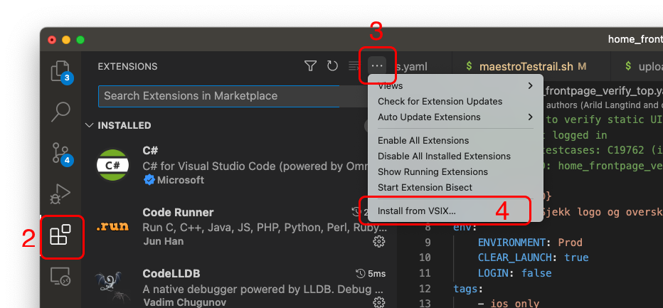

# VSCode Maestro Assistant

Maestro Assistant is a Visual Studio Code extension that provides useful Maestro shortcuts and simplifies repetitive workflows, like creating or running flows.

## Getting Started

1. Install the Maestro Assistant extension. See [manual install](#manual-install) for instructions.
2. Configure the extension. See [configuration](#configuration).
3. Open the Maestro-project in VSCode.
4. Enjoy! 

## Usage
This extension currently supports the following commands:
1. Maestro: Run Maestro flows with the current file
2. Maestro: Create a new flow from template
3. Maestro: Copy AutomationID to clipboard

**Open Command Palette and type "Maestro" to see available commands.**

### 1. Maestro: Run Maestro flows with the current file
This command displays a list of available commands, which are configured in the "maestro-assistant.commands" section in settings.json. You can select and invoke these commands to run Maestro flows with the currently opened file.

### 2. Maestro: Create a new flow from template
This command allows you to create a new flow using templates stored in the configured templates folder. This feature simplifies the process of setting up new test flows, ensuring consistency and reducing the time needed to start new tests.

### 3. Maestro: Copy AutomationID to clipboard
This command is used to fetch the Automation ID needed for test management software, such as TestRail. The Automation ID corresponds with the output you get when running Maestro with JUnit reporting. By having the Automation ID readily available in your clipboard, you can easily input it into your test management software, streamlining the process of tracking and managing test cases.


## Configuration


### Commands
You can configure the Maestro Assistant extension commands by modifying the `maestro-assistant.commands` object in your `settings.json` file. Each key in the object represents a platform, and its value is the corresponding command to run Maestro tests on that platform.

For example:

```json
"maestro-assistant.commands": {
    "iOS": "maestro test -e APP_ID=no.agens.maestro.ios -e PLATFORM=ios {FILE_PATH}",
    "Android": "maestro test -e APP_ID=no.agens.maestro.android -e PLATFORM=android {FILE_PATH}"
}
```
### Template Folder Path
By default, the extension looks for template flows in the `${workspaceFolder}/templates` directory. If you prefer to store your templates elsewhere, you can update the configuration to point to the desired location.

### Test Root Folder
By default, the extension looks for test flows in the `${workspaceFolder}/tests` directory. If your tests are stored in a different folder, you can configure the extension to search for the correct path. When using the `Maestro: Create a new flow from template` command, you can choose the subfolder (if any) where you'd like to save the flow.
## Templates

The Maestro Assistant extension uses templates to create new flows. By default, the template path is set to `${workspaceFolder}/templates`. You can change the template path in your `settings.json` file in Visual Studio Code.

### Template Example

Here's an example of a template file (flow_template.yaml):

```yaml
// CLEAR_LAUNCH: true, false
// ENVIRONMENT: prod, qa01, dev
// LOGIN: true, false
// PROXY: true, false

# {{description}}

appId: ${APP_ID}
name: {{FLOW_NAME}}
env:
  CLEAR_LAUNCH: {{CLEAR_LAUNCH}}
  ENVIRONMENT: {{ENVIRONMENT}}
  LOGIN: {{LOGIN}}
  PROXY: {{PROXY}}
---

# TODO: Add Maestro commands, if any, you want to be a part of the template
- launchApp

```
The first three lines define valid input values for the placeholders. When running the "Create Flow" command, the user will be presented with a selection list to choose from these predefined values. A placeholder like {{description}} without a predefined value in the template file will give a free-text input field.


## Changelog
See [CHANGELOG.md](CHANGELOG.md) for updated changelog.

## Manual install

Until this extension is distributed through the Marketplace you have to install it manually.

1. Download the latest .vsix file from the repository or release page.
2. Launch Visual Studio Code and open the Extensions view by clicking on the Extensions icon in the Activity Bar on the side of the window.
3. Click on the "More Actions" button (represented by three dots) located in the top-right corner of the Extensions view.
4. Select "Install from VSIX..." from the dropdown menu.
5. Navigate to the downloaded .vsix file and click on "Open" to install the extension.




Once the installation is complete, the extension will be activated and ready for use.
